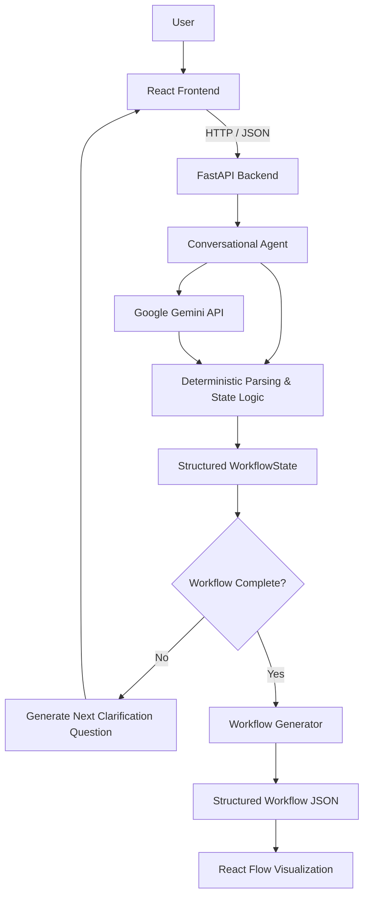

# Conversational Workflow Builder

> **Digitomics AI Engineer Assignment — Conversational Workflow Builder**

An AI-powered conversational workflow planner that converts natural-language automation requests into structured workflow representations through an intelligent clarification process.

**Live Demo:** https://conversational-workflow-builder-1.onrender.com  
**Repository:** https://github.com/sameeksha2999/conversational-workflow-builder

---

## Overview

The Conversational Workflow Builder is designed around a simple principle:

> **Do not assume missing information. Ask for it.**

A user describes an automation in natural language, for example:

> "Whenever a new invoice arrives, notify my finance team."

Instead of immediately generating a workflow with guessed values, the assistant identifies information that is missing or ambiguous and asks focused clarification questions one at a time.

The system continues the conversation until the information required for that specific workflow has been collected. It then generates a structured workflow representation and displays it visually.

This project is a **workflow planning and representation system**. It does **not** execute workflows or connect to external automation services.

---

## Assignment Alignment

The implementation directly addresses the core requirements of the Digitomics assignment:

| Assignment Requirement | Implementation |
|---|---|
| Understand natural-language automation requests | Gemini-assisted analysis + deterministic parsing |
| Identify missing information | Structured `WorkflowState` and missing-information logic |
| Ask intelligent clarification questions | Clarification agent with one-question-at-a-time flow |
| Detect ambiguity | `ambiguities` state field and clarification handling |
| Preserve collected information | Pydantic `WorkflowState` |
| Continue until required information is complete | Completion and missing-information checks |
| Generate a complete workflow representation | `workflow.py` |
| Support conditional workflows | Condition nodes with YES/NO branches |
| Visualize the generated workflow | React + `@xyflow/react` |
| Avoid workflow execution | Representation-only architecture |

The assignment explicitly focuses on understanding a request, collecting required information, and generating a workflow representation rather than executing the automation. This project follows that scope.

---

## Key Features

### 1. Natural-Language Workflow Input

Users can describe an automation request without needing to know a workflow schema.

Example:

```text
Whenever a new invoice arrives, notify my finance team.
```

### 2. Intelligent Clarification

The system identifies information that is not yet available and asks for it instead of inventing values.

Example:

```text
User:
Whenever a new invoice arrives, notify my finance team.

Assistant:
Which platform or system should provide or be monitored for this event?

User:
Gmail

Assistant:
How would you like to be notified?

User:
Email

Assistant:
Who should receive the notification?

User:
Finance team
```

Once the required information is collected, the workflow becomes ready for generation.

### 3. Structured Conversation State

The backend maintains structured state instead of depending only on raw chat history.

The state can track:

- Goal
- Trigger
- Trigger source
- Monitoring location
- Actions
- Conditions
- Notifications
- Notification channel
- Notification recipient
- Duplicate handling
- Additional requirements
- Required fields
- Missing information
- Ambiguities
- Previously asked questions
- Workflow status

### 4. One Question at a Time

The clarification flow is intentionally focused: the assistant asks one clarification question at a time so that each answer can be associated with the correct missing workflow information.

### 5. Conditional Workflows

The system supports workflows containing conditions and YES/NO branches.

Example:

```text
New Support Ticket
        |
        v
  Priority Check
     /       \
   YES       NO
    |         |
    v         v
Notify      Create
Support     Follow-up
    \         /
     \       /
       v   v
        End
```

### 6. Visual Workflow Representation

Completed workflows are rendered as a node-based graph using `@xyflow/react`.

The generated graph can contain:

- Trigger nodes
- Action nodes
- Notification nodes
- Condition nodes
- YES/NO branches
- Merge/Continue nodes
- End nodes

The visualization is read-only because this application is a planner/representation tool rather than a workflow execution engine.

---

## Architecture



### Design Approach

The application separates the system into four main responsibilities:

```text
Natural Language / Conversation
              ↓
      Agent & Analysis
              ↓
     Structured State
              ↓
    Workflow Generation
              ↓
    Visual Representation
```

This separation keeps conversational understanding, state management, workflow generation, and presentation independent.

---

## AI + Deterministic Logic

The project uses a hybrid approach.

### AI layer

Google Gemini is used for natural-language understanding and structured analysis, including:

- Understanding the user's message
- Extracting workflow information
- Identifying missing information
- Detecting ambiguity
- Producing structured analysis

### Deterministic layer

Application logic is responsible for predictable workflow-state operations such as:

- Updating collected information
- Preserving previously collected values
- Determining missing information
- Processing short clarification answers such as `Gmail`, `Email`, or `Finance team`
- Avoiding duplicate workflow information
- Handling conditional branches
- Deciding when workflow generation is allowed
- Building the final workflow graph

This design allows the AI layer to handle natural language while keeping workflow generation controlled and predictable.

---

## Project Structure

```text
conversational-workflow-builder/
│
├── backend/
│   ├── app/
│   │   ├── __init__.py
│   │   ├── agent.py
│   │   ├── main.py
│   │   ├── models.py
│   │   └── workflow.py
│   │
│   ├── tests/
│   │   └── test_workflow.py
│   │
│   ├── .env.example
│   ├── .gitignore
│   └── requirements.txt
│
├── frontend/
│   ├── src/
│   │   ├── App.jsx
│   │   ├── App.css
│   │   ├── index.css
│   │   └── main.jsx
│   │
│   ├── index.html
│   ├── package.json
│   ├── package-lock.json
│   └── vite.config.js
│
├── .gitignore
└── README.md
```

### Backend Modules

#### `agent.py`

Core conversational intelligence and workflow-planning logic.

Responsibilities include:

- Natural-language processing
- Information extraction
- Clarification handling
- Missing-information detection
- Ambiguity handling
- Workflow-state updates
- Completion detection
- Gemini integration

#### `models.py`

Defines the Pydantic models used by the application, including:

- `WorkflowState`
- `WorkflowItem`
- `ConditionItem`
- `ChatRequest`
- `ChatResponse`
- `AIAnalysis`

#### `workflow.py`

Converts the collected `WorkflowState` into a workflow graph containing:

- Nodes
- Edges
- Trigger nodes
- Action nodes
- Notification nodes
- Condition nodes
- YES/NO branches
- Merge/Continue nodes
- End node

The function generates a representation only; it does not execute any automation.

#### `main.py`

FastAPI application entry point.

The primary endpoint is:

```text
POST /chat
```

---

## API

### `POST /chat`

Processes the current user message together with the current workflow state.

#### Request

```json
{
  "message": "Gmail",
  "state": {
    "goal": "Notify finance team when a new invoice arrives"
  }
}
```

#### Response

```json
{
  "reply": "How would you like to be notified?",
  "state": {},
  "workflow": null
}
```

When all required information has been collected, `workflow` contains the generated workflow representation.

---

## Technology Stack

### Frontend

- React
- Vite
- JavaScript
- `@xyflow/react`
- CSS

### Backend

- Python
- FastAPI
- Pydantic
- Uvicorn
- python-dotenv

### AI

- Google Gemini API

### Development / Deployment

- Git
- GitHub
- Render

---

## Local Setup

### Prerequisites

Install:

- Python 3.x
- Node.js and npm
- Git
- A Google Gemini API key

### 1. Clone the repository

```bash
git clone https://github.com/sameeksha2999/conversational-workflow-builder.git
cd conversational-workflow-builder
```

### 2. Configure the backend

```bash
cd backend
python -m venv venv
```

#### Windows

```bash
venv\Scripts\activate
```

#### macOS / Linux

```bash
source venv/bin/activate
```

Install backend dependencies:

```bash
pip install -r requirements.txt
```

Create:

```text
backend/.env
```

Add:

```env
GEMINI_API_KEY=your_gemini_api_key
```

Start the FastAPI server:

```bash
python -m uvicorn app.main:app --reload
```

Backend:

```text
http://127.0.0.1:8000
```

### 3. Start the frontend

Open another terminal:

```bash
cd frontend
npm install
npm run dev
```

Open the Vite URL shown in the terminal, normally:

```text
http://localhost:5173
```

### Optional frontend environment variable

The frontend defaults to:

```text
http://127.0.0.1:8000
```

To point it to another backend:

```env
VITE_API_URL=http://your-backend-url
```

---

## Environment Variables

Only the backend requires an API key:

```env
GEMINI_API_KEY=your_gemini_api_key
```

The real `.env` file should never be committed to GitHub.

A template is provided as:

```text
backend/.env.example
```

---

## Testing

The repository contains backend tests for workflow generation.

Test file:

```text
backend/tests/test_workflow.py
```

The tests cover:

- Linear workflow generation
- Conditional workflow generation
- YES/NO branch creation
- End-node generation

To run the tests:

```bash
cd backend
pip install pytest
pytest
```

---

## Example Workflow

### Input

```text
Whenever a new support ticket arrives.
If the ticket is high priority, notify the support team;
otherwise create a follow-up task.
```

The system can collect the required trigger source and notification information through clarification questions and then produce a representation similar to:

```text
New Support Ticket
        |
        v
  Priority Check
     /       \
   YES       NO
    |         |
    v         v
Email       Follow-up
Alert        Task
    \         /
     \       /
       v   v
        End
```

---

## Scope and Limitations

### Included

- Natural-language workflow understanding
- Clarification questions
- Missing-information detection
- Structured conversation state
- Ambiguity tracking
- Workflow completion detection
- Structured workflow generation
- Conditional workflow representation
- Visual workflow rendering

### Intentionally Not Included

- Executing generated workflows
- Sending real emails or notifications
- Connecting to Gmail, Slack, Zendesk, or other external automation services
- Managing third-party credentials
- Triggering real-world automation

The generated workflow is a **representation of the intended automation**, not an executable automation.

---

## Engineering Decisions

### Structured state instead of chat-history-only reasoning

Workflow information is stored in a typed Pydantic state model. This makes required fields, missing information, ambiguities, actions, conditions, notifications, and completion status explicit.

### AI for understanding, deterministic logic for control

The AI layer handles natural-language interpretation, while deterministic application logic controls state updates and workflow generation.

### Separation of responsibilities

The project separates:

```text
Agent Logic
     ↓
State Models
     ↓
Workflow Generation
     ↓
Frontend Visualization
```

This makes the codebase easier to inspect, test, explain, and extend.

---

## Deployment

The application is deployed as separate frontend and backend services on Render.

**Frontend:**  
https://conversational-workflow-builder-1.onrender.com

**Backend:**  
https://conversational-workflow-builder-backend.onrender.com

---

## Assignment Submission

**Assignment:** Digitomics AI Engineer Selection Process  
**Project:** Conversational Workflow Builder

The project demonstrates:

- AI-assisted workflow understanding
- Conversational clarification
- Structured state management
- Ambiguity and missing-information handling
- Workflow generation
- Conditional branching
- Visual workflow representation
- Separation between AI reasoning and deterministic application logic

---

## Author

**Sameeksha**  
B.E. — Artificial Intelligence & Data Science

---


